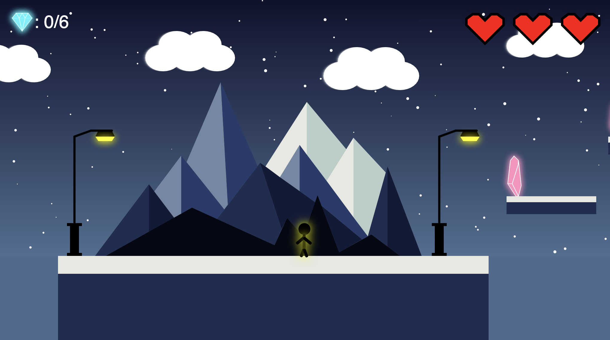

# 2D Platformer Game

[](https://github.com/naveenlabs/2D-Platformer-Game) [](LICENSE) [](README.md)

A fully playable 2D platformer game built with p5.js. Features character animation, enemy AI, collision detection, collectible diamonds, canyon obstacles, and dynamic audio. Navigate through an expansive level, collect diamonds, and reach the flagpole to win.

## Overview

This is a complete, interactive platformer game demonstrating core game development concepts including physics simulation, collision detection, enemy AI, state management, and audio integration. Players navigate through a challenging level filled with platforms, enemies, and collectible diamonds.

## Main Interface



## Features

- **Character Animation** – 8 different animated poses for movement and states
- **Physics & Gravity** – Realistic gravity, jumping mechanics, and collision response
- **Platform Jumping** – Navigate using crystal-designed platforms
- **Enemy AI** – Patrolling enemies with collision detection
- **Canyon Obstacles** – Deadly gaps that cause instant death
- **Collectible Diamonds** – 6 diamonds scattered throughout level with glowing effects
- **Audio System** – Background music + sound effects (jump, collect, death)
- **Dynamic UI** – Real-time score display with beating heart lives counter
- **Side-Scrolling Camera** – Follows player through expansive level
- **Win Condition** – Reach flagpole after collecting all diamonds
- **Visual Polish** – Shadow effects, gradient backgrounds, animated weather elements

## Controls

| Input | Action |
|-------|--------|
| Arrow Keys / WASD | Move left and right |
| Space / Up Arrow / W | Jump |

## Tech Stack

- **JavaScript** – Core game logic
- **p5.js** – Canvas rendering and animation
- **p5.sound.js** – Audio management
- **HTML5** – Document structure
- **Custom Fonts** – Bungee (titles), Honk (UI)

## Gameplay

**Objective:** Collect all 6 diamonds and reach the flagpole to win.

**Lives System:** Start with 3 lives. Lose a life by:
- Touching an enemy
- Falling into a canyon
- Falling below the screen

**Level Design:**
- 7 deadly canyons of varying widths
- 10+ platforms for navigation
- Multiple enemies patrolling different zones
- Expansive level design (~7200px wide)

**Audio:**
- Background music loops continuously
- Sound effects for jump, diamond collection, and death
- Volume balanced for gameplay feedback

## Game Architecture

### Core Systems

**Physics Engine**
- Gravity simulation with acceleration
- Jump velocity and falling detection
- Platform collision with tolerance checks
- Canyon fall detection

**Collision Detection**
- Distance-based detection for diamonds and enemies
- Bounding box checks for platforms
- Multi-condition checks for canyon detection

**Animation System**
- Character pose switching based on movement state
- Limb rotation using transform matrices
- Visual effects (shadows, glows, beats)

**Enemy AI**
- Horizontal patrol within defined ranges
- Boundary detection and direction reversal
- Contact detection with player

**Audio Management**
- Preloading all sounds on startup
- Volume control per sound type
- One-time sound triggers (death sound)

## Getting Started

### Prerequisites
- Any modern web browser
- Local web server (required for audio and font loading)

### Installation

1. **Clone the repository:**
```bash
git clone https://github.com/naveenlabs/2D-Platformer-Game.git
cd 2D-Platformer-Game
```

2. **Run a local server:**

**Python:**
```bash
python3 -m http.server 8000
# Visit http://localhost:8000
```

**Node.js:**
```bash
npx http-server
```

3. **Play:**
- Move with arrow keys or WASD
- Jump with space or up arrow
- Collect diamonds
- Reach the flagpole to win

## Game Features Explained

**Character Movement**
- Smooth left/right movement with continuous input
- Gravity-based jumping with proper arc
- Animation states respond to movement direction

**Enemy Patrols**
- Enemies patrol horizontally within their zones
- Bounce back when reaching patrol boundaries
- Instant death on contact with player

**Diamond Collection**
- Glowing cyan appearance for easy visibility
- Proximity-based collection (30px radius)
- Score increments as each diamond collected

**Platform Navigation**
- Platforms act as safe landing zones
- Jump from platforms to reach higher areas
- Multiple platform chains create level progression

**Canyon Dangers**
- Various widths create different difficulty levels
- Walking or falling into canyon causes instant death
- Requires careful positioning and jumping

## Project Documentation

📄 **[View Project Commentary](Documentation/Game%20Project%20Commentary.pdf)**

Detailed documentation covering game design, technical implementation, and evaluation.

## Browser Support

| Browser | Support |
|---------|---------|
| Chrome | ✅ Full |
| Firefox | ✅ Full |
| Safari | ✅ Full |
| Edge | ✅ Full |

## Performance

- Stable 60 FPS gameplay
- Quick load time with asset preloading
- Optimized collision checks

## Author

**Dhanarasu Naveen**  
Computer Science (AI & Machine Learning Specialisation)  
University of London via SIM Singapore

## License

MIT License – see [LICENSE](LICENSE) file for details

## Resources

- [p5.js Documentation](https://p5js.org/)
- [p5.sound Reference](https://p5js.org/reference/#/libraries/p5.sound)
- [Game Development Concepts](https://developer.mozilla.org/en-US/docs/Games)

---

**A complete, fully functional platformer game demonstrating core game development principles.**
